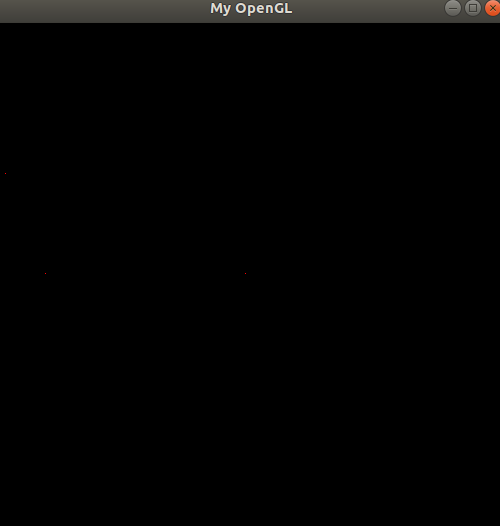
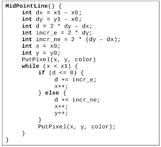
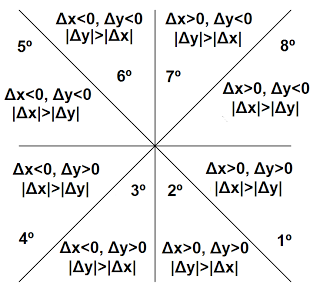
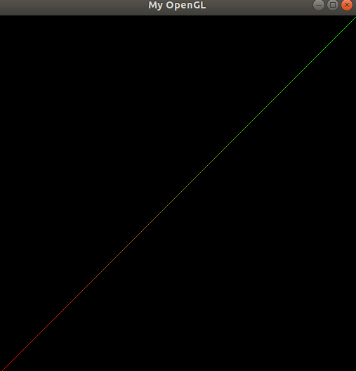
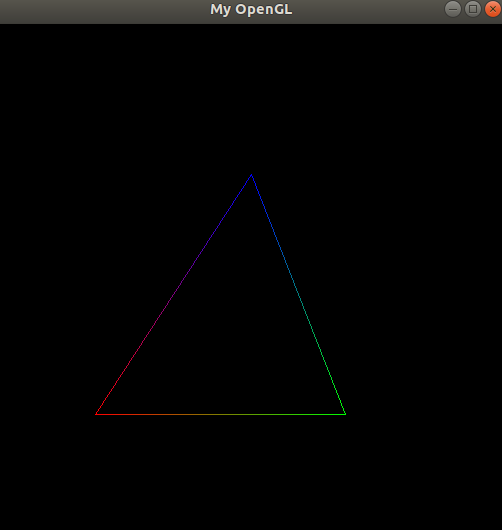

# Rasterização de pontos e linhas 

## Introdução

<p>O objetivo deste trabalho é desenvolver um maior entendimento sobre algoritmos de rasterização de pontos e linhas. O foco foi entender e desenvolver funções implementando os conceitos aprendidos na disciplina Introdução à computação gráfica, utilizando o framework cedido pelo professor Christian Azambuja.</p>
<p>A seguir, serão discutidas as funções PutPixel, DrawLine e DrawTriangle.</p>

### PutPixel(tPixel pixel, tColor color)

<p>Uma imagem é formada por um conjunto de pixels, então o primeiro passo era conseguir rasterizar um pixel na tela. Como alterações à memória de vídeo são restritas pelo sistema operacional, o acesso se dava por uma simulação pelo ponteiro FBptr.</p>

```c
typedef struct {
	int red;
	int green;
	int blue;
	int alpha;
} tColor;

typedef struct {
	int x;
	int y;
} tPixel;

```

```c
void PutPixel(tPixel pixel, tColor color) {
	int c = 4*pixel.x + 4*pixel.y*IMAGE_WIDTH;

	FBptr[c] = color.red;
	FBptr[c + 1] = color.green;
	FBptr[c + 2] = color.blue;
	FBptr[c + 3] = color.alpha;
};
```

<p align="center">
<h5>PutPixel({250, 250}, {255, 0, 0, 255});</h5>
<br>
</p>
<p align="center">
<h5>({250, 250}, {255, 0, 0, 255}), ({50, 250}, {255, 0, 0, 255}), ({10, 150}, {255, 0, 0, 255})</h5>
	
</p>
	
### DrawLine(tPixel init, tPixel end, tColor color1, tColor2)

</p>Para a rasterização de linhas foi usado o algoritmo de Bresenham. Famoso por sua eficiência, já que o mesmo utiliza somente operações aritméticas simples, o algoritmo de Bresenham escolhe o pixel a ser desenhado por aproximação de uma linha que passa entre dois pontos. É bastante empregado para desenhar primitivas.</p>
<p>A função foi desenvolvida a partir do algoritmo de ponto médio, apresentado nas notas de aula do professor Christian.</p>

<p align="center">

</p>

<p>O código acima é referente a primeira octante, então uma implementação para as demais octantes se fez necessária. 
O desenvolvimento foi feito seguindo os próximos conceitos.</p>
	
<p align="center">

</p>
<p>
xI = x inicial<br>
xF = x final<br>
yI = y inicial<br>
yF = y final </p>
<br>

>primeiro octante: o coeficiente angular varia entre 0 e 1 (0 <= m <= 1) e xI < xF<br>
segundo octante: o coeficiente angular é maior do que 1 (m > 1) e yI < yF<br>
terceiro octante:  o coeficiente angular é menor do que -1 (m < -1) e yI < yF<br>
quarto octante: o coeficiente angular varia entre 0 e -1 (0 >= m >= -1) e xF < xI<br>
quinto octante: o coeficiente angular varia entre 0 e 1 (0 <= m <= 1)  e xF < xI<br>
sexto octante: o coeficiente angular é maior do que 1 (m > 1) e yF < yI<br>
sétimo octante: o coeficiente angular é menor do que -1 (m < -1) e yF < yI<br>
oitavo octante:  o coeficiente angular varia entre 0 e -1 (0 >= m >= -1) e xI < xF<br>

<p align="center">
<h5>({0, 512}, {512, 0}, {255, 0, 0, 255}, {0, 255, 0, 255})</h5>

</p>


### DrawTriangle(tPixel v1, tPixel v2, tPixel v3, tColor c1, tColor c2, tColor c3)

<p>Após o processo de criação da função para rasterização de linhas, o desenvolvimento de um triângulo torna-se bastante simples. É necessário apenas a passagem de coordenadas para o desenho de três linhas com alguns vértices coincidentes</p>

```c
void DrawTriangle(tPixel v1, tPixel v2, tPixel, v3, tColor c1, tColor, c2, tColor c3) {
        DrawLine({100, 390}, {256, 150}, {255, 0, 0, 255}, {0, 0, 255, 255});	
	DrawLine({256, 150}, {350, 390}, {0, 0, 255, 255}, {0, 255, 0, 255});
	DrawLine({100, 390}, {350, 390}, {255, 0, 0, 255}, {0, 255, 0, 255});

}

```

<p align="center">

</p>

<br>

### Dificuldades
<p>Certamente, a maior dificuldade do trabalho foi concluir a função DrawLine. Encontrar todas as relações matemáticas para todas as octantes, além de implementá-las algoritmicamente foi algo bastante trabalhoso, mas foi um ótimo exercício.</p>

### Referências 

<ul>
	<li>http://matheuspraxedescg.blogspot.com/2016/08/trabalho-1-rasterizacao-de-ponto-e-linha.html</li>
	<li>https://medium.com/@biancaamoriim/rasteriza%C3%A7%C3%A3o-de-primitivas-em-opengl-8680a76fdda5</li>
	<li>https://en.wikipedia.org/wiki/Rasterisation</li>
	<li>Slides do professor Christian Azambuja</li>
</ul>


